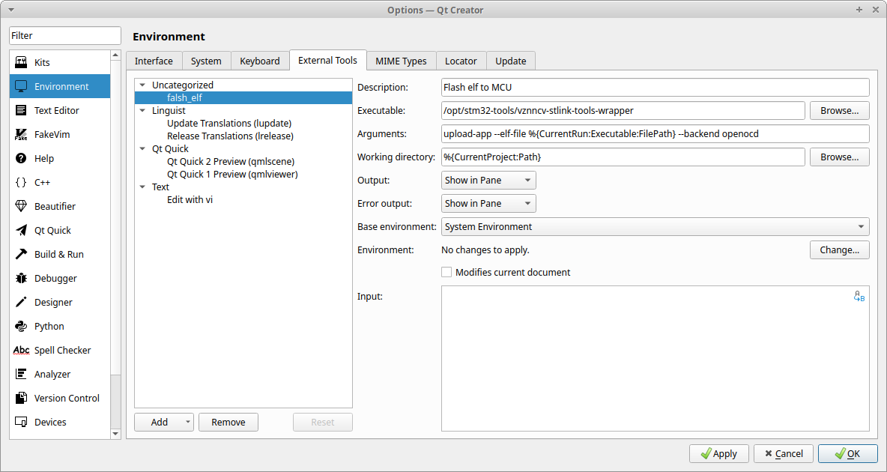
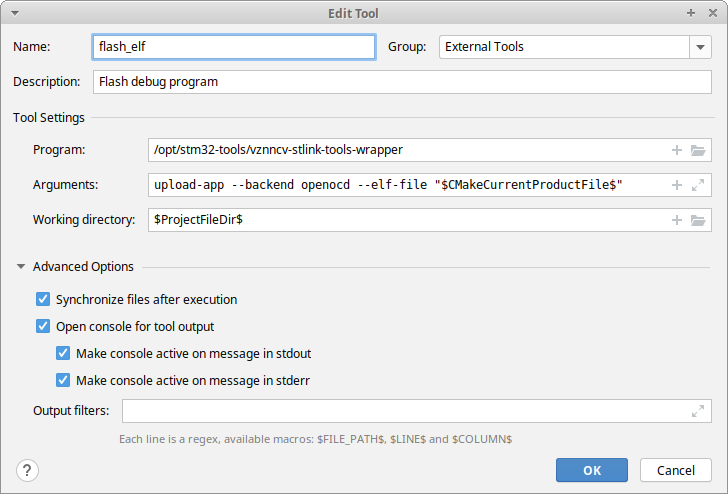

# vznncv-stlink-tools-wrapper

Helper wrapper around other stlink tools to simplify their integration with IDE.

## Usage

1. Show connected ST-Link devices:

   Command:
   ```
   ./vznncv-stlink-tools-wrapper show-devices
   ```

   Output example:

   ```
   device: ST-Link V2
   vendor id: 0x0483
   product id: 0x3748
   hla serial: 34006A063141323910300243
   ```

2. Upload program with `OpenOCD`:

    1. Add `openocd_device.cfg` with your device configuration to project root.
    2. Compile project.
    3. Run command:

       ```
       ./vznncv-stlink-tools-wrapper upload-app --backend openocd --elf-file BUILD
       ```

       Notes:
        - instead of an exact elf file location you can specify build directory with it.

3. Upload program with `pyocd`:

    1. Compile project.
    2. Run

       ```
       ./vznncv-stlink-tools-wrapper upload-app --backend openocd --pyocd-target stm32f411ce --elf-file BUILD
       ```

   Notes:
    - instead of an exact elf file location you can specify build directory with it.
    - `--pyocd-target <target>` option is required.
    - before `--pyocd-target <target>` usage, you need:
        1. Find target name: `pyocd pack --find <name_glob_expression>`
        2. Install target pack: `pyocd pack --install <target>`

## IDE Integration

### QtCreator

1. Open "Tools" -> "External" -> "Configure".
2. Add `vznncv-stlink-tools-wrapper` as external tool:

   

   tool options:
    - name: `flash_elf`
    - arguments: `upload-app --elf-file %{CurrentRun:Executable:FilePath} --backend openocd`
    - working directory: `%{CurrentProject:Path}`

3. After it, you should be able to use it via as external tool to flash firmware via a menu:
   "Tools" -> "External" -> "flash_elf".

4. Additionally, you can assign a keyboard shortcut to this tool.

### CLion

1. Open "File" -> "Settings"
2. Go to "Tools" -> "External Tools" and create a new one:

   

   tool options:
    - name: `flash_elf`
    - arguments: `upload-app --backend openocd --elf-file "$CMakeCurrentProductFile$"`
    - working directory: `$ProjectFileDir$`

3. After it, you should be able to use it via as external tool to flash firmware via a menu:
   "Tools" -> "External Tools" -> "flash_elf".

4. Additionally, you can assign a keyboard shortcut to this tool.
